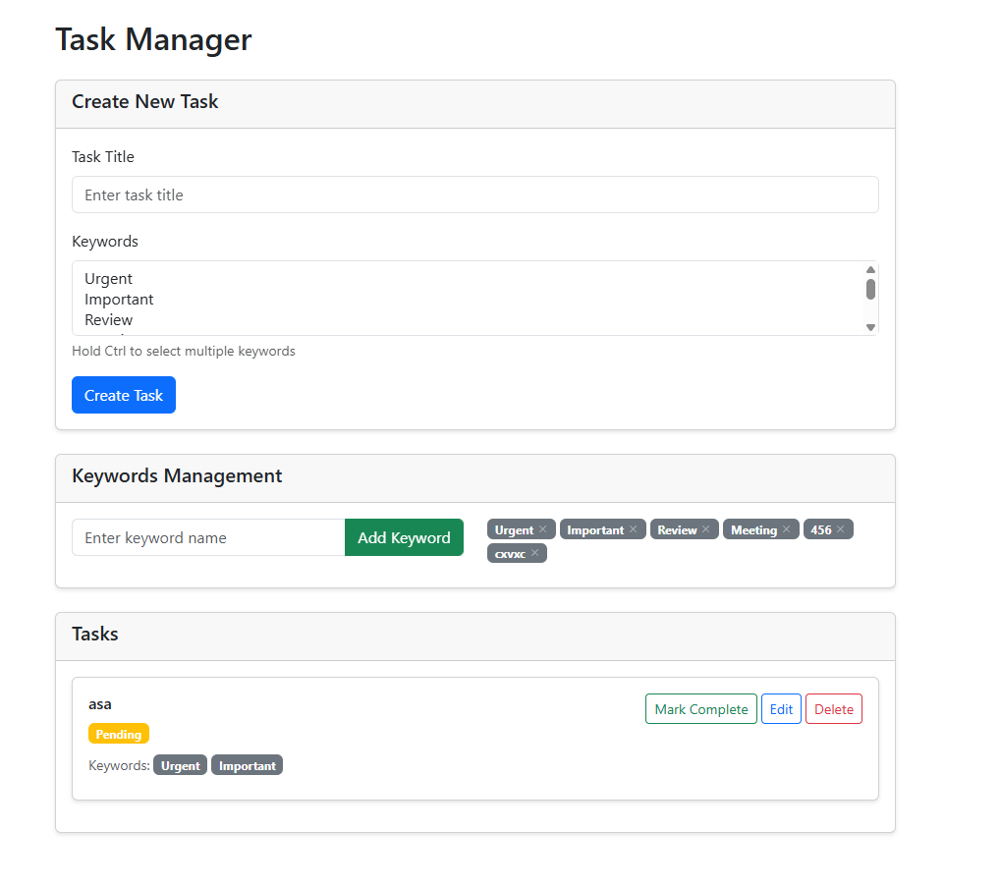

# Task Manager - Laravel + Vue 3

Una aplicación de gestión de tareas desarrollada con Laravel (backend) y Vue 3 (
frontend).

## Características

- ✅ Crear tareas con título
- ✅ Editar tareas existentes
- ✅ Eliminar tareas
- ✅ Asignar keywords reutilizables a las tareas
- ✅ Gestionar keywords (crear/eliminar)
- ✅ Cambiar el estado de las tareas (completado/pendiente)
- ✅ Listar todas las tareas con sus keywords asociadas
- ✅ API REST completa
- ✅ Interfaz moderna con Bootstrap 5
- ✅ Componente Vue 3 con Composition API

## Tecnologías Utilizadas

### Backend

- **Laravel 12** - Framework PHP
- **SQLite** - Base de datos
- **Eloquent ORM** - ORM de Laravel

### Frontend

- **Vue 3** - Framework JavaScript con Composition API
- **Bootstrap 5** - Framework CSS
- **Axios** - Cliente HTTP
- **Vite** - Build tool

## Instalación y Configuración

### Prerrequisitos

- PHP 8.2+
- Composer
- Node.js 18+
- npm

### Pasos de Instalación

1. **Clonar el repositorio**
   ```bash
   git clone <repository-url>
   cd examen
   ```

2. **Instalar dependencias de PHP**
   ```bash
   composer install
   ```

3. **Configurar variables de entorno**
   ```bash
   cp .env.example .env
   php artisan key:generate
   ```

4. **Configurar base de datos**
   El proyecto está configurado para usar SQLite. El archivo
   `database/database.sqlite` ya está creado.

5. **Ejecutar migraciones**
   ```bash
   php artisan migrate
   ```

6. **Instalar dependencias de Node.js**
   ```bash
   npm install
   ```

7. **Compilar assets**
   ```bash
   npm run build
   ```

8. **Iniciar servidor de desarrollo**
   ```bash
   php artisan serve
   ```

9. **Acceder a la aplicación**
   Abrir http://localhost:8000 en el navegador

## API Endpoints

### Tareas

- `GET /api/tasks` - Listar todas las tareas con keywords
- `POST /api/tasks` - Crear nueva tarea
- `PUT /api/tasks/{id}` - Actualizar tarea existente
- `DELETE /api/tasks/{id}` - Eliminar tarea
- `PATCH /api/tasks/{id}/toggle` - Cambiar estado de tarea

### Keywords

- `GET /api/keywords` - Listar todas las keywords
- `POST /api/keywords` - Crear nueva keyword
- `DELETE /api/keywords/{id}` - Eliminar keyword

## Estructura del Proyecto

```
app/
├── Http/
│   ├── Controllers/
│   │   ├── TaskController.php
│   │   └── KeywordController.php
│   └── Requests/
│       └── TaskRequest.php
├── Models/
│   ├── Task.php
│   └── Keyword.php
database/
├── migrations/
│   ├── create_tasks_table.php
│   ├── create_keywords_table.php
│   └── create_task_keyword_table.php
resources/
├── js/
│   ├── components/
│   │   └── TaskList.vue
│   └── app.js
└── views/
    └── welcome.blade.php
routes/
└── api.php
```

## Funcionalidades Implementadas

### Backend (Laravel)

- ✅ Migraciones para tablas `tasks`, `keywords` y `task_keyword`
- ✅ Modelos con relaciones many-to-many
- ✅ Controladores con métodos CRUD completos
- ✅ Validación de datos con FormRequest
- ✅ Rutas API RESTful
- ✅ Manejo de errores y respuestas JSON

### Frontend (Vue 3)

- ✅ Componente TaskList con `<script setup>`
- ✅ Consumo de API con Axios
- ✅ Interfaz responsive con Bootstrap
- ✅ Formulario para crear/editar tareas
- ✅ Gestión completa de keywords
- ✅ Selección múltiple de keywords
- ✅ Toggle de estado de tareas
- ✅ Botones de edición y eliminación
- ✅ Lista de tareas con keywords asociadas
- ✅ Confirmaciones para acciones destructivas

## Criterios de Evaluación Cumplidos

- ✅ **Funcionalidad completa (30%)**: Todas las funcionalidades requeridas
  implementadas
- ✅ **Uso correcto de Vue 3 `<script setup>` (20%)**: Componente implementado
  con Composition API
- ✅ **Estructura y claridad del código Laravel (20%)**: Código bien estructurado
  y organizado
- ✅ **Validaciones y manejo de errores (10%)**: Validaciones implementadas en
  backend y frontend
- ✅ **Buenas prácticas generales (10%)**: Código limpio y bien documentado
- ✅ **UX mínima, clara y funcional (10%)**: Interfaz intuitiva con Bootstrap

## Uso de la Aplicación

### Gestión de Tareas

1. **Ver tareas**: Al cargar la página se muestran todas las tareas existentes
2. **Crear tarea**:
    - Ingresar título en el campo de texto
    - Seleccionar keywords (mantener Ctrl para múltiple selección)
    - Hacer clic en "Create Task"
3. **Editar tarea**:
    - Hacer clic en "Edit" en la tarea deseada
    - Modificar título y keywords
    - Hacer clic en "Update Task"
4. **Eliminar tarea**:
    - Hacer clic en "Delete" en la tarea deseada
    - Confirmar la eliminación
5. **Cambiar estado**: Hacer clic en "Mark Complete" o "Mark Pending"

### Gestión de Keywords

1. **Agregar keyword**:
    - Escribir nombre en el campo de texto
    - Hacer clic en "Add Keyword"
2. **Eliminar keyword**:
    - Hacer clic en la "X" del badge de la keyword
    - Confirmar la eliminación
3. **Keywords**: Las keywords se muestran como badges debajo de cada tarea

## Datos de Prueba

El sistema incluye keywords de prueba:

- Urgent
- Important
- Review
- Meeting

## Desarrollo

Para desarrollo con hot reload:

```bash
# Terminal 1 - Backend
php artisan serve

# Terminal 2 - Frontend
npm run dev
```

## Licencia

Este proyecto es parte de un examen técnico.


